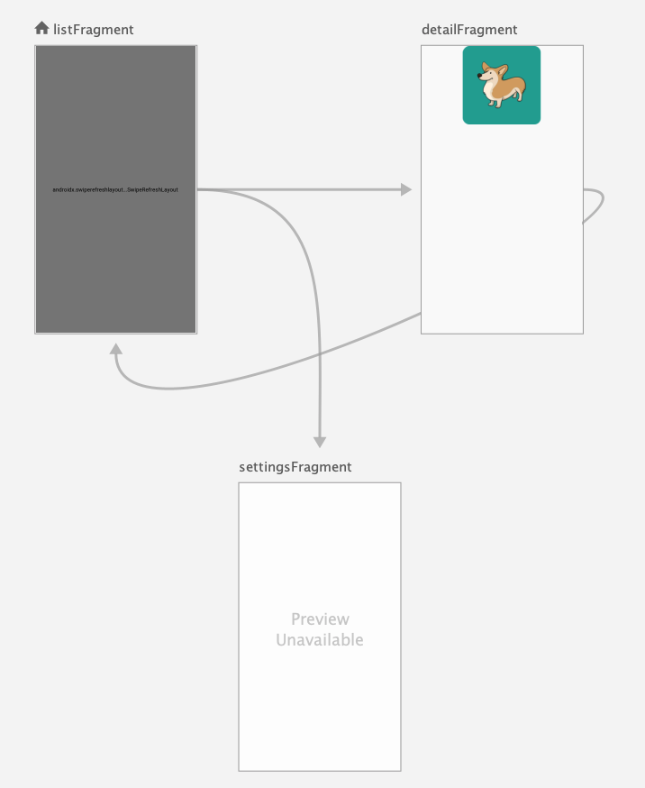

# Android Jetpack Project :  Masterclass in Java

## What is Android Jetpack?
Jetpack is a suite of libraries, tools, and guidance to help developers write high-quality apps easier.
Jetpack comprises the androidx package libraries, that provide backward compatibility, and that must be used after support version 28.00
Below I will make a brief summary of the libraries seen in this project.

## Navigation
- Handles user journey through the app
- Removes complexity when moving from one screen to another
- Handles complex cases like:
  - Bottom tabbed navigation
  - App drawers
- Works with _generated classes_
#### Benefits
- Handles fragment transactions
- Handles back and up actions
- Manages de backstack
- Argument passing
- Transition animations
- Deep linking
#### Components
- Navigation Graph
- Nav host fragment
- Nav controller

  <p align=center>
    
  </p>
  <p align=right><small><i>navigation graph used in this excercise</i></small></p>
  
## LiveData
Is a component that is part of the Lifecycle framework that Android provides.

- **It is an OBSERVABLE:** _Object that emits some data_

- **Is Lifecycle aware:**  _It handles the lifecycle of the components attached to it. LiveData only emits data if the OBSERVER attached to it is in an **active state**_

- **No memory leaks**  _Because of the lifecycle awareness_

- **Always up to date data**  _If anything is attached to LiveData, will receive the latest information._

- **Manages configuration Changes**

## MVVM
Architectural Pattern (Model - View - ViewModel)

- **VIEW** 
_It is responsible of displaying information for the users. Ideally, only the view will be aware of the Android ecosystem_

- **MODEL** 
_It is the data_

- **VIEWMODEL** 
_It receives the data from the MODEL and prepares it in a way that the view can display it._
_There is a **component** called ViewModel_

## ViewModel

- Lifecycle aware component
- It has its own lifecycle
- It manages to attach itself to fragments

There are two components available for the ViewModel:

#### ViewModel

We will use this one if we want to separate completely it's functionality from everything related to Android ecosystem (context, fragment, activity, ...)

This way, our ViewModel will exist independently of our Android App.

#### AndroidViewModel

If our ViewModel depends somehow of our Android App, for instance if we want to save data in our device, we'll need a reference to a **Context**.

We usually do not want references to Activities or Fragments Context because they are very transients.

AndroidViewModel allows us to access the ApplicationContext, that has a lifecycle much wider.

- _Ideally every VIEW should have it's own ViewModel_
- _Is is important to instanciate the ViewModel using:

```
        viewModel = ViewModelProviders.of(this).get(ListViewModel.class);
```
_This way, every time we create the fragment (this), the ViewModel will handle it the updated data, and we will NOT instanciate a new ViewModel, sine it has an independent lifecycle_

## Retrofit

- Third party library
- Facilitates retrieving data from an API
- Works with JSON, XML, and others
- Works well with RxJava

#### Components

- POJO class (Plain Old Java Object)
- API Interface
  - Specifies the endpoints used
  - Defines methods
  - @GET, @POST, @PUT, ...
- Service Class
  - Specifies the Base URL
  - Any required factory methods

## Glide

- Third party library
- Image Loading and caching:
_Create a Glide Object, give it an URL, Give it an ImageView reference -> It will load the image while doing the processing and the network communication on the **background thread**_
- Provides image resize and display options

#### Glide v.4

- It works with a Generated API
- You must create a class that extends AppGlideModule and has the annotation @GlideModule
- Glide's generated API can be extended by both Applications and Libraries.
 - You must generate a class with the annotation @GlideExtension.
 - Its methods must be _static_ and to be annotated with @GlideOption
 
 ## Room
 
 - **Abstraction layer over SQL**
 It allows us to store info on a local device in a DB while providing some Object Oriented functionality.
 We don't need to manage the connection or inserting objects manually into tables.
 
 - **Easily store objects in a DataBase**
 
 - **Generated Classes**
 It creates the classes that we need based on the **entities** that we provide. It does it at compile time.
 
 - **Compile time checks**
It makes sure we don't write any queries that are incompatible with the database functionality.

- **Database migration functionality**

- **Unit Testing functionality**

- **Database access on background thread**  
We access the DB asyncronously.  
Android doesn't allow asyncronous communication on the main thread.  
Room provides methods to do that either through _RxJava_ or using _Coroutines_.

#### Setup

- @Entity: POJO that stores some info. Room will transform this into a table.

- @Dao (Data Access Object): It is an Interface. It is the object that provides the functionality (insert, update, ...)

- @Database: It is the class that's going to create the database

#### Queries

- Checked at compile time:
@Insert
@Update
@Delete
@Query

- Not checked at compile time:
@RawQuery

## Data Binding

- **Bind Data and functionality to lyouts**   
It removes some configuration from our _functional classes_ and it moves it into the layout.  
You can bind:
  - Data (variables, parameters, ...)
  - Functionality (method calls, operators, ...)

- **Reduce boilerplate code** . 
Reduces the complexity of our classes

- **Generated Classes**

#### Bindings
- **Variables** . 
You can attach an object to a layout and have the values of that object automatically displayed on the screen  

- **Method Calls**
For instance listeners

- **Custom Adapters**   
It is a way for the databinding library to introduce parameters in our widgets or views

- **Operators**

#### Components

- **Layout tag**
```
<layout> 
```
In the layout xml file.
Must be the top element
Must include the xmlns

- **Data to bind**
```
<data>
  <variable name = " "
            type = " " />
</data>
```

- **DataBindingUtil**
Utility class that allows us to inflate the layout with our new <layout> element and provides some functionality to attach various elements to our layout.
It is the connector class.

- **_LayourName_ Binding**
Generated class.
It allows us to attach the variables that we declare to that specific layout.

- **@BindingAdapter**
The one that allows us to create the custom attributes and allows us to attach custom functionality to the custom attributes

## Palette

- Facilitates application design
- Extracts colors from images
- Colors can be applied to visual elements
- Color profiles: 
  - Light vibrant
  - Vibrant
  - Dark vibrant
  - Light muted
  - Muted
  - Dark muted


## Notifications

- **Mesage outside the app**

- **Provide info or bring the user to the app**

- **Push notifications**
Send a notification from a backend to a device.

- **Can have attached actions**

#### Types

**Status bar / drawer notification**
- First sign that something happened.
- Icon at the top of the app
- User can expand the notification drawer

**Expanded notification**
- Giving the user the option to increase the size of the notification and provide more information

**Heads Up notification**
- Higher importance. 
- Will show up at the top of your screen even if you are using the phone. For instance, a *phone call*

**Lock Screen notifications**
- In the lock screen
- It may be possible to expand it

#### Components

**Groups**
A way for notifications to be grouped together. In example, when you have multiple emails.

**Channels**
Introduced in Android 8.0  
Is a way to divide notifications into different channels and give the user the option to _turn off_ some of them

**Importance**
Depending on the urgency of the action required by the user

**Builder**

## Preferences

- It is part of Android Jetpack Libraries
- It allows users to change app functionality
- Manages UI
- Automatically stores updated preferences
- Preferences are retrieved through **SharedPreferences**

#### Components

- PreferenceScreen XML
- Preference
- PreferenceFragment _extends PreferenceFragmentCompat_

## Permissions

**Protect user privacy**

**Normal vs Dangerous permissions**
- Normal permission: for instance Internet permission
- Dangerous permission: Send SMS messages or Access User Contact List

**Pre API 23 vs Post API 23 (Android M)**
- Pre API 23: User had to accept all or nothing
- Post API 23: The application will ask for the aproval of every dangerous permission.

**Permission groups**
Gouping related permissions.  
For instance, _read contants_ and _write contacts_ are in the same group. Once the user accept one, the application has permissions for all the group.

**A Fragment can't ask for permission, ony Activities can**

#### Flowchart


